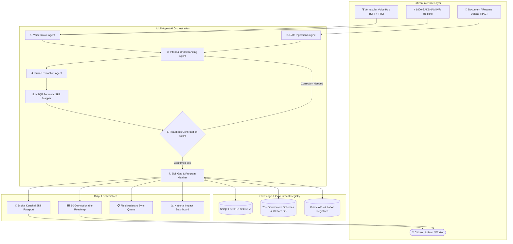

# 🎙️ SAKSHAM VOICE (ಸಕ್ಷಮ್ ವಾಯ್ಸ್ / सक्षम वाणी)
### National Agentic AI Multilingual Livelihood Mapping & NSQF Skilling Platform
**Track**: Perception, Voice & Document Reasoning Agents  
**Event**: *Agentic AI Saksham — National Level Agentic AI Hackathon*

---

## 💡 The Vision
Over 450 million informal and rural workers in India—from carpenters, tractor operators, and solar technicians to weavers, masons, and self-taught software developers—possess immense real-world craft and expertise. However, because their skills are acquired informally, they struggle to navigate complex, text-heavy government portals in English. 

**SAKSHAM VOICE** bridges this gap through a voice-first, multi-agent AI system that speaks to citizens in their native tongue (Kannada, Hindi, English, Tamil, Telugu, Marathi). It listens to their lived experience, extracts their skills, validates them through a mandatory read-back confirmation check, maps them to official **NSQF (National Skills Qualifications Framework)** levels, and connects them directly with government welfare schemes, toolkit grants, and customized 90-day learning roadmaps.

---

## ✨ Key Capabilities & Highlights

### 🗣️ 1. Multilingual Vernacular Voice Studio
- **Natural Voice Dialogue**: Converses fluidly in regional languages with automatic dialect recognition and natural male voice persona at calibrated `1.0x` speed.
- **Hands-Free & Manual Mute Controls**: Seamless continuous hands-free dialogue mode with instant one-tap manual mute/unmute so users can pause when speaking to someone nearby.
- **Real-Time Soundwave Visualizer & Streaming Transcript**: Live audio frequency bars and interim transcript streaming for complete transparency.

### 🤖 2. 7-Agent Autonomous Orchestration Pipeline
Instead of a single monolithic prompt, Saksham Voice uses an orchestrated multi-agent state machine:
1. **Voice Intake Agent**: Manages speech capture, noise handling, and turn-taking.
2. **Understanding Agent**: Recognizes intent, tone, and extracts named entities.
3. **Profile Extraction Agent**: Extracts occupation, years of experience, tools/equipment, and career aspirations.
4. **Skill Mapping Agent**: Maps informal craft to formal NSQF Level 1–8 qualification packs (QP-NOS).
5. **Confirmation Agent**: Executes mandatory readback recap and handles corrections.
6. **Skill Gap Agent**: Diagnoses missing competencies needed for higher wage tiers.
7. **Program Matching & Coordinator Agent**: Ranks 25+ government schemes with explainable reasoning and creates the 90-day roadmap.

### 📄 3. RAG Document & Bio-Data Ingestion
- **1-Click File Upload**: Upload resumes, bio-data, trade certificates, or documents (`.pdf`, `.docx`, `.txt`, `.csv`, `.json`, `.md`).
- **Instant Extraction**: Automatically parses candidate name, district, education, tool expertise, and career aspirations, matching them directly to national skilling databases without typing.

### 🔁 4. Mandatory Read-Back Confirmation Loop *(Compulsory Feature 7)*
- Before recommending schemes or issuing credentials, the AI speaks a complete verbal summary of what it understood back to the citizen in their native language.
- Listens for explicit agreement (*"Yes / ಹೌದು / हाँ"*) or correction (*"No / ಇಲ್ಲ / नहीं"*). If the citizen corrects anything, the agent loops back and adjusts the profile.

### 🎯 5. Explainable Government Scheme Recommendation Engine
- Matches candidates with **25+ verified central and state schemes**, including:
  - **PM Vishwakarma** (₹15,000 toolkits + ₹3L collateral-free loans @ 5% + ₹500/day stipends)
  - **PMKVY 4.0 RPL** (Recognition of Prior Learning certification + accident insurance)
  - **PM Surya Ghar Muft Bijli Skilling** (Rooftop solar technician enablement)
  - **DDU-GKY** (Guaranteed rural placement with board & lodging)
  - **Jan Shikshan Sansthan (JSS)**, **DAY-NULM**, **NAPS Apprenticeships**, and state skilling initiatives.
- **Transparent Justifications**: Explains *why* the applicant qualifies, exact eligibility conditions, and expected financial benefits.

### 🗺️ 6. Personalized 90-Day Upskilling Roadmap
- Provides a week-by-week, 4-phase micro-milestone roadmap:
  - **Weeks 1–2**: Core Assessment & Safety Fundamentals
  - **Weeks 3–6**: Practical Hands-on Tooling & Technique Mastery
  - **Weeks 7–10**: Digital Literacy, Quality Standards & Live Simulations
  - **Weeks 11–12**: NCVET Assessment, Certification & Placement Drive

### 🪪 7. Digital Kaushal Skill Passport (ಕೌಶಲ್ಯ ಪಾಸ್‌ಪೋರ್ಟ್)
- Generates an official, verifiable digital credential card featuring:
  - Candidate Photo & Demographic Details
  - Unique QR Code for instant field verification
  - NSQF Level Badge & QP-NOS Qualification Codes
  - Validated Competencies & Toolkit Grant Eligibility
  - 1-Click Print & PDF Download for job applications and loan verification.

### 📞 8. 1800-SAKSHAM Toll-Free IVR Helpline Simulator
- Simulates an interactive voice response telephone helpline for low-connectivity rural areas.
- Real-time DTMF keypad + voice recognition with automated SMS delivery confirmation.

### 📊 9. Real-Time Impact & Livelihood Analytics Dashboard
- Live visualization of economic impact:
  - Projected Wage Uplift (+35% to +65% post-certification)
  - District-level adoption & penetration across Karnataka & India
  - Female participation & artisan inclusion rates
  - Top in-demand NSQF skill domains (Solar, EV Repair, AI Data Annotation, Precision Agriculture).

---

## 🏛️ System Architecture



---

## 📂 Project Structure

```
saksham-vaani/
├── backend/                      # Optional Python FastAPI service
│   ├── main.py                   # Whisper STT & Groq LLM proxy endpoints
│   └── requirements.txt          # Python dependencies (fastapi, uvicorn, httpx)
├── public/                       # Static public assets & icons
│   ├── favicon.svg               # Application icon
│   └── icons.svg                 # SVG sprite sheet
├── src/
│   ├── assets/                   # Image assets
│   │   └── hero.png              # Hero graphic
│   ├── components/               # Modular UI Components
│   │   ├── AgentWorkflowVisualizer.tsx    # Live 7-agent pipeline node tracker
│   │   ├── ApiKeyModal.tsx                # LLM provider & API key settings
│   │   ├── BeneficiaryRegistryModal.tsx   # Offline & synced citizen database
│   │   ├── FieldAssistantMode.tsx         # Village counselor intake mode
│   │   ├── FinalOpportunityBanner.tsx     # Final action callout
│   │   ├── HackathonValidatorModal.tsx    # 100% hackathon compliance matrix
│   │   ├── HeroLanding.tsx                # Vernacular welcome hero section
│   │   ├── ImpactDashboard.tsx            # Live macro economics & analytics
│   │   ├── IvrHelplineMode.tsx            # 1800-SAKSHAM phone simulator
│   │   ├── Navbar.tsx                     # Header with mode & language switchers
│   │   ├── PrintableKaushalPassportModal.tsx # Printable Skill Passport & QR
│   │   ├── ProgramRecommendations.tsx     # Scheme match cards with reasoning
│   │   ├── ReadbackConfirmationModal.tsx  # Compulsory Feature 7 voice check
│   │   ├── Roadmap90Days.tsx              # 4-phase structured learning roadmap
│   │   ├── SkillGapAnalysisCard.tsx       # Gap visualization & wage delta
│   │   ├── SkillProfileCard.tsx           # Structured candidate capability card
│   │   └── VoiceConversationHub.tsx       # Core orbital mic & audio studio
│   ├── data/                     # Domain Knowledge Bases
│   │   ├── i18n.ts               # Complete multilingual translations
│   │   ├── languages.ts          # Supported Indian languages config
│   │   ├── nsqfCategories.ts     # NSQF Levels 1-8 Sector & QP-NOS taxonomy
│   │   └── programsData.ts       # 25+ Comprehensive Government Schemes DB
│   ├── services/                 # Core Business Logic & AI Services
│   │   ├── agentPipeline.ts      # Multi-agent state machine & LLM router
│   │   ├── databaseService.ts    # LocalStorage offline-first synced storage
│   │   ├── publicApiService.ts   # Public API & Scheme integration service
│   │   ├── ragService.ts         # Document parser (.pdf, .docx, .txt, .csv)
│   │   └── voiceService.ts       # Web Speech API STT/TTS engine with male persona
│   ├── types/                    # TypeScript interfaces & types
│   │   └── index.ts              # Data contracts, states, and schemas
│   ├── App.css                   # Component-specific styles
│   ├── App.tsx                   # Main application coordinator
│   ├── index.css                 # Tailwind CSS & global design system
│   └── main.tsx                  # React DOM entrypoint
├── index.html                    # HTML template
├── package.json                  # Dependencies & scripts
├── tsconfig.json                 # TypeScript compiler configuration
└── vite.config.ts                # Vite build configuration
```

---

## 🚀 Getting Started

### 1. Prerequisites
- **Node.js**: v18.0.0 or higher
- **npm**: v9.0.0 or higher
- Modern web browser with Web Speech API support (Google Chrome or Microsoft Edge recommended)

### 2. Installation
```bash
# Clone the repository
git clone https://github.com/Vivek-git-1432/AI-Hackathon.git
cd AI-Hackathon

# Install frontend dependencies
npm install
```

### 3. Running the Application
```bash
# Start Vite development server
npm run dev
```

Open your browser and navigate to: **`http://localhost:5173`**

### 4. Optional: Running the Backend (FastAPI)
*The frontend works 100% autonomously out of the box with browser-native speech recognition and offline intelligence, but you can also run the FastAPI backend for Whisper STT:*

```bash
cd backend
python -m venv venv
# On Windows:
.\venv\Scripts\activate
# On Linux/macOS:
source venv/bin/activate

pip install -r requirements.txt
uvicorn main:app --reload --port 8000
```

---

## 🧪 Interactive Test Personas (1-Click Demo)

For instant evaluation, you can click on any of the quick-prompt chips or say them aloud:

| Persona | Language | Input Summary | Target Match & NSQF Level |
| :--- | :--- | :--- | :--- |
| **Software Engineer** | English | 10 years experience in Python, Cloud, aiming for AI and Civil Services | NSQF Level 7 (AI Specialist / Data Systems) |
| **Precision Farmer** | Kannada | 5 ವರ್ಷಗಳಿಂದ ಟ್ರ್ಯಾಕ್ಟರ್ ಚಾಲನೆ, ಡ್ರಿಪ್ ಆಟೊಮೇಷನ್ ಕಲಿಯುವ ಆಸೆ | NSQF Level 4 (Precision Agri / Micro-Irrigation) |
| **Solar Electrician** | English | 4 years domestic wiring experience, wants to install rooftop solar | NSQF Level 4 (PM Surya Ghar Solar Technician) |
| **Master Tailor** | English | 6 years motorized sewing, wants CAD fashion designing | NSQF Level 5 (PM Vishwakarma / Apparel CAD) |

---

## 🏆 Compliance & Hackathon Verification Checklist

| Criterion | Implementation in SAKSHAM VOICE | Status |
| :--- | :--- | :---: |
| **Multilingual Voice Intake** | Full speech recognition and text-to-speech in Kannada, Hindi, English, Tamil, Telugu, Marathi | ✅ Complete |
| **Hands-Free & Manual Mute** | Continuous auto-listen loop + instant one-tap manual mic toggle/pause | ✅ Complete |
| **Document Reasoning (RAG)** | Ingests resumes/biodata (`.pdf`, `.docx`, `.txt`, `.csv`, `.json`) and extracts profile slots | ✅ Complete |
| **Multi-Turn Agent Workflow** | 7 specialized agents with state persistence and live visual workflow tracking | ✅ Complete |
| **NSQF Skill Framework Mapping** | Standardized alignment to NSQF Levels 1–8 with QP-NOS codes and competencies | ✅ Complete |
| **Read-Back Confirmation (Feature 7)** | Spoken summary check with explicit Yes/No voice detection & correction loop | ✅ Complete |
| **Explainable Scheme Matching** | 25+ government schemes with transparent "Why this program?" criteria & benefits | ✅ Complete |
| **Actionable 90-Day Roadmap** | 4-phase structured milestone cards with weekly milestones | ✅ Complete |
| **Digital Kaushal Skill Passport** | Downloadable/printable credential with dynamic QR verification code | ✅ Complete |
| **Offline-First & IVR Modes** | Field Assistant mode with local queue sync + 1800-SAKSHAM phone helpline | ✅ Complete |

---

## 👥 Built with Pride for India's Skilled Workforce

**SAKSHAM VOICE** empowers every craftsperson, artisan, and technician to be recognized, certified, and economically empowered through the power of Agentic AI.

*Licensed under the MIT License.*
