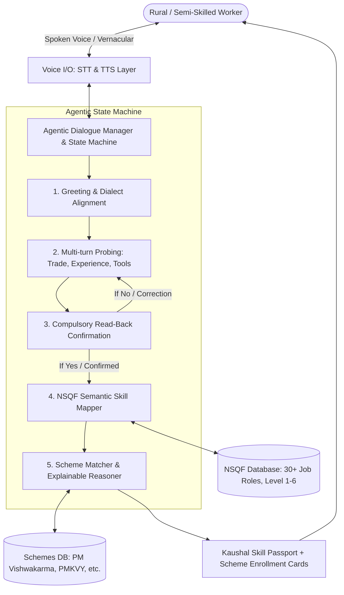

# 🎙️ SakshamVaani (सक्षम वाणी)
### Voice-Based Livelihood Mapping & Skilling Recommendation Agent
**Track**: Perception, Voice & Document Reasoning Agents  
**Event**: *Agentic AI Saksham — National Level Agentic AI Hackathon*

---

## 📌 Problem Overview
Many rural and unorganized informal workers across India struggle to navigate long, complex, text-based government skilling portals—especially when delivered in English. This creates a severe barrier to accessing life-changing welfare programs, toolkit grants, and formal wage employment.

**SakshamVaani** is a voice-first, agentic conversational system that converses with rural workers in their native Indian language (Hindi, Hinglish, Tamil, Telugu, Marathi, Bengali, Kannada, English), understands their informal craft and tools, maps their experience to structured **NSQF (National Skills Qualifications Framework)** levels, executes a **mandatory read-back confirmation loop**, and recommends tailored Government Skilling Programs (*PM Vishwakarma*, *PMKVY 4.0 RPL*, *PM Surya Ghar*, *DDU-GKY*) with explainable reasoning and instant **Kaushal Skill Passports**.

---

## 🌟 Key Features

### 1. Multilingual Voice-First Intake
- Real-time Speech-to-Text (STT) and native Text-to-Speech (TTS) loop in regional Indian languages.
- Live pulsating audio waveform visualizer and transcript streaming.
- Dual-mode support: voice conversation or accessible text messaging.

### 2. Mandatory Read-Back Confirmation Loop (COMPULSORY FEATURE 7)
- Prior to finalizing recommendations, the agent summarizes its understanding in the worker's native tongue (*"मैंने समझा कि आप पिछले 8 वर्षों से बढ़ई का काम कर रहे हैं..."*).
- Listens for explicit affirmative or negative intent (`Yes` / `No` / `हाँ` / `ना`).
- **Correction Handling**: If the worker indicates an error or answers "No", the agent empathetically loops back to clarify and correct its understanding before proceeding.

### 3. Structured NSQF Skill Mapping (Levels 1–6)
- Converts informal trade narratives into standardized NSQF sectors, job roles, and **Qualification Pack (QP-NOS)** codes.
- Extracts tool usage, daily techniques, and experience duration automatically.

### 4. Explainable Government Scheme Recommendation Engine
- Curated database of 20+ schemes (*PM Vishwakarma*, *PMKVY 4.0 RPL*, *PM Surya Ghar Muft Bijli Skilling*, *DDU-GKY*, *Jan Shikshan Sansthan*, *DAY-NULM*, *NAPS-2*).
- Provides transparent, human-readable justifications explaining *why* the worker qualifies.
- Highlights exact benefits: ₹15,000 Toolkit e-vouchers, ₹500/day stipends, ₹3L subsidized credit @ 5%, and free NCVET certifications.

### 5. Digital Kaushal Skill Passport (कौशल पहचान पत्र)
- Generates an official, printable/shareable digital identity card with QR code verification, NSQF level badges, and competency tags.

### 6. 1-Click Live Test Personas for Evaluators & Judges
- Pre-configured realistic rural personas (*Ramesh - Carpenter*, *Sunita - Tailor*, *Kavita - Solar Electrician*, *Murugan - Auto Mechanic*, *Anil - Organic Farmer*) allowing judges to test the entire conversational loop with a single click.

---

## 🏗️ Architecture & State Machine



---

## 🚀 Quick Start & Running Locally

### Prerequisites
- Node.js (v18+)
- npm

### Installation & Launch
```bash
# 1. Navigate to project folder
cd saksham-vaani

# 2. Install dependencies
npm install

# 3. Start development server
npm run dev
```
Open [http://localhost:5173](http://localhost:5173) in your browser.

### Running Automated Test Suite
```bash
npx tsx src/tests/test_suite.ts
```

---

## 🏆 Evaluation Parameters Checklist

| Hackathon Parameter | Implementation in SakshamVaani | Status |
| :--- | :--- | :---: |
| **Voice Input in Indian Language** | Full voice loop in Hindi, Hinglish, Tamil, Telugu, Bengali, Marathi, Kannada, English | ✅ Complete |
| **Natural Conversational Flow** | Warm multi-turn dialogue with proactive follow-up questions | ✅ Complete |
| **Skill-Category / NSQF Mapping** | Semantic mapping to 30+ NSQF qualification packs (QP-NOS) & levels (1–6) | ✅ Complete |
| **Skilling Recommendation with Reasoning** | Multi-scheme ranking with transparent "Why this program?" explainability | ✅ Complete |
| **Compulsory Feature 7 (Read-Back Check)** | Spoken summary confirmation + Yes/No voice detection + loopback error correction | ✅ Complete |
| **Digital Kaushal Passport** | Printable digital credential card with QR code & NCVET alignment | ✅ Complete |
| **1-Click Evaluator Personas** | 5 pre-loaded interactive rural worker personas for instant judging | ✅ Complete |

---

## 📄 License
MIT License • Developed for *Agentic AI Saksham Hackathon*.
